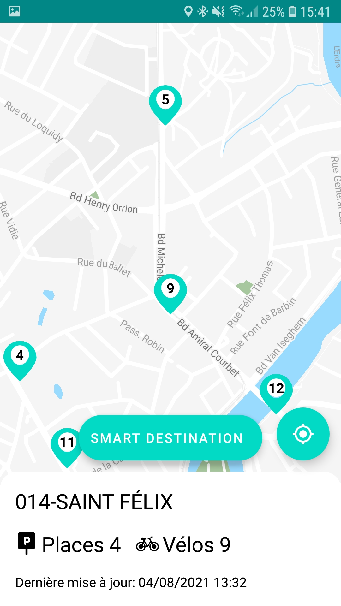
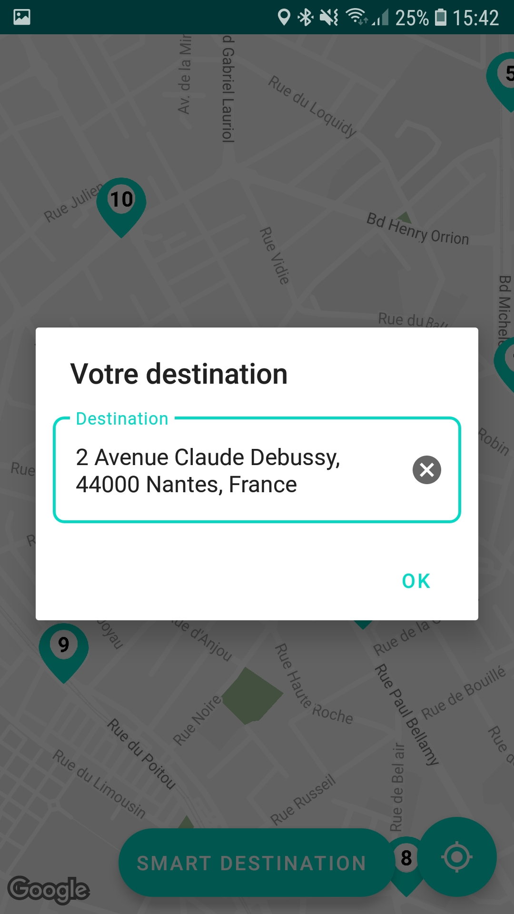
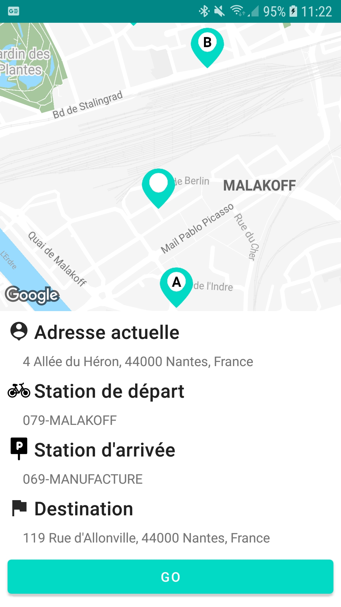

# Tap & Go

La société TapAndGo met à disposition des parcs de vélos pour les usagers dans plusieurs villes de France.

## Images

## Features

- [x] Une partie pour visualiser le nombre et l’emplacement des stations de Bicloo sous forme de carte et de liste

- [x] L’utilisateur doit pouvoir renseigner un point de départ ainsi qu’un point d'arrivée et l’application
doit lui proposer une station de départ et d’arrivée correspondantes.

- [x] Lors de la recherche des stations, l’algorithme doit permettre à l’utilisateur de prendre un vélo et le
déposer dans la station la plus proche du point d’arrivée. Il faut donc prendre en compte le nombre
de places et de vélos disponibles.

- [ ] Une partie pour consulter le détail d’une station

- [ ] Le client aimerait également que les utilisateurs puissent filtrer et chercher une station en fonction
de son nom, de son état (ouvert ou fermé) et de la disponibilité de Bicloo.

## Tips

Faire un "appui long" sur la carte permet de saisir automatiquement l'adresse de destination